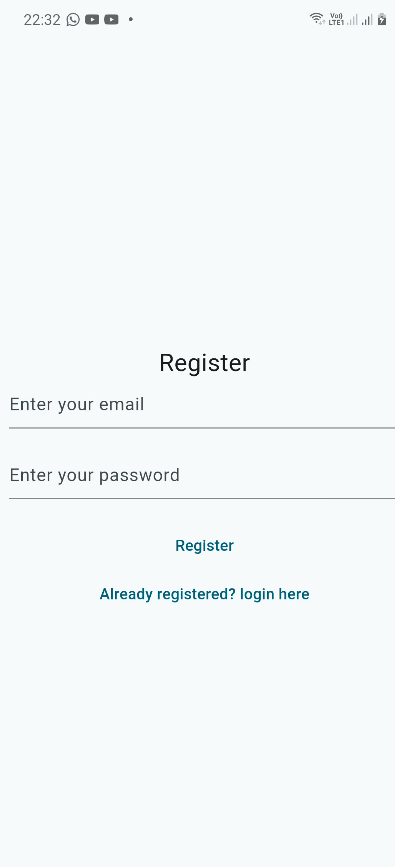
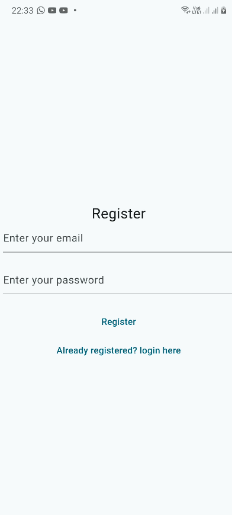
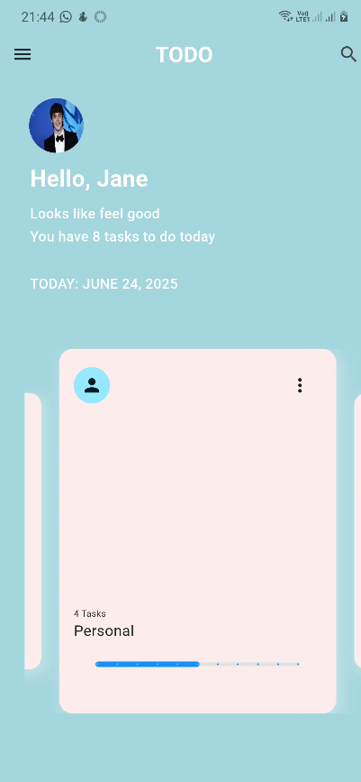
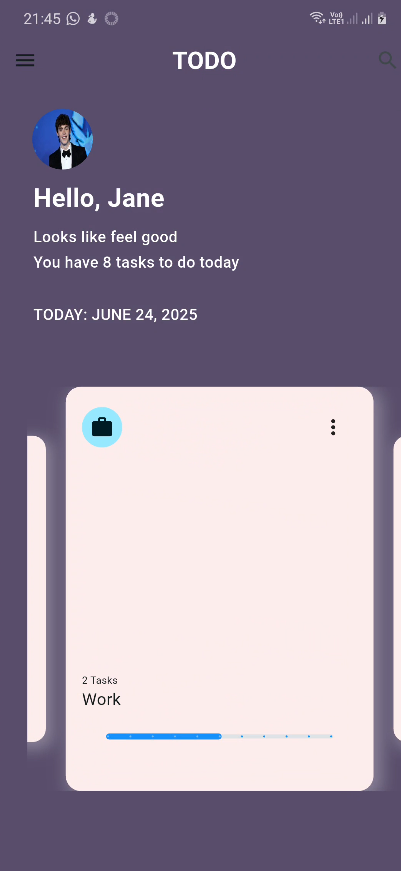
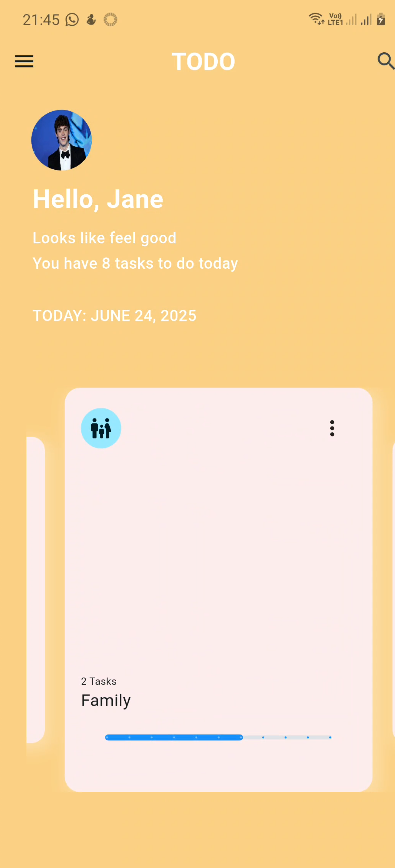
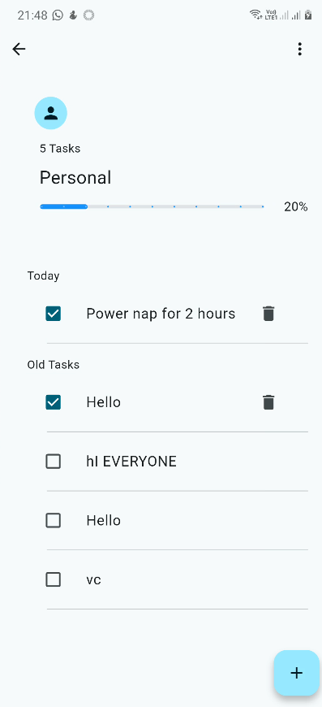
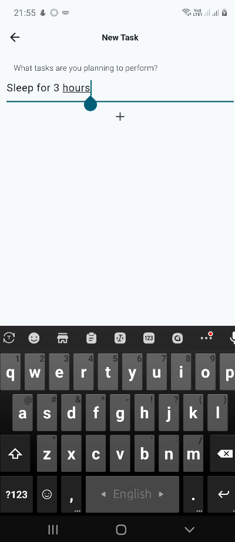

# 📝 Todo App

A simple and clean Flutter-based **Todo App** designed to help users manage daily tasks efficiently. The app supports user authentication, categorized task management, and real-time cloud data syncing using Firebase.

---
## Overview of the app

Below are some screenshots demonstrating the app in action:

### 🔐 Registration View


### 🔑 Login View


### 🏠 Home Screen






### ➕ Add Task


### 📝 Task List


## 🚀 Features

- 🔐 **User Registration & Login** (via Firebase Auth)
- 🗂️ **Categorized Tasks**  
  Users can add tasks under different categories like:
  - `Daily Tasks`
  - `Daily Work`
  - `Family Task`
- 🗑️ **Delete Tasks**  
  Tasks can be deleted easily when completed or no longer needed.
- 📅 **Daily Remaining Tasks**  
  The home screen shows all pending tasks for the day.

---

## 📦 Dependencies

This app is built using the following Flutter packages:

- [`firebase_core`](https://pub.dev/packages/firebase_core)
- [`firebase_auth`](https://pub.dev/packages/firebase_auth)
- [`cloud_firestore`](https://pub.dev/packages/cloud_firestore)
- [`firebase_analytics`](https://pub.dev/packages/firebase_analytics)
- [`provider`](https://pub.dev/packages/provider)
- [`intl`](https://pub.dev/packages/intl)

---

## 🧠 State Management

The app uses **Provider** for managing state efficiently across the app.

---

## ☁️ Backend

- **Firebase Backend Only**  
  Used for:
  - User Authentication
  - Cloud Firestore for task storage
  - Analytics

---

## 🎯 Platform Support

- ✅ Android  
- ✅ iOS  
- ✅ macOS  

---

## ⚙️ Firebase Setup Instructions

> If you want to use this app with your own Firebase project, follow these steps:

1. Go to the official Firebase Flutter setup guide:  
   📄 [Firebase Flutter Setup Docs](https://firebase.google.com/docs/flutter/setup?platform=ios)

2. In the Firebase Console:
   - Create a new project.
   - Create **3 Firestore collections**:
     ```
     tododaily
     workdaily
     familytask
     ```

3. Open your terminal in the project directory and run:
   ```bash
   flutterfire configure
   firebase login
   flutter pub get
   flutter run
